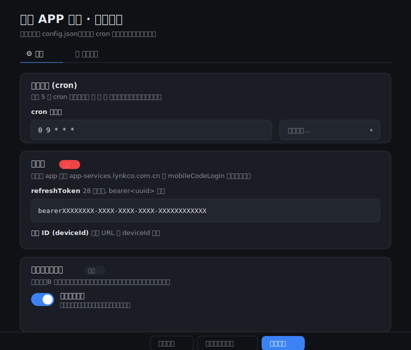
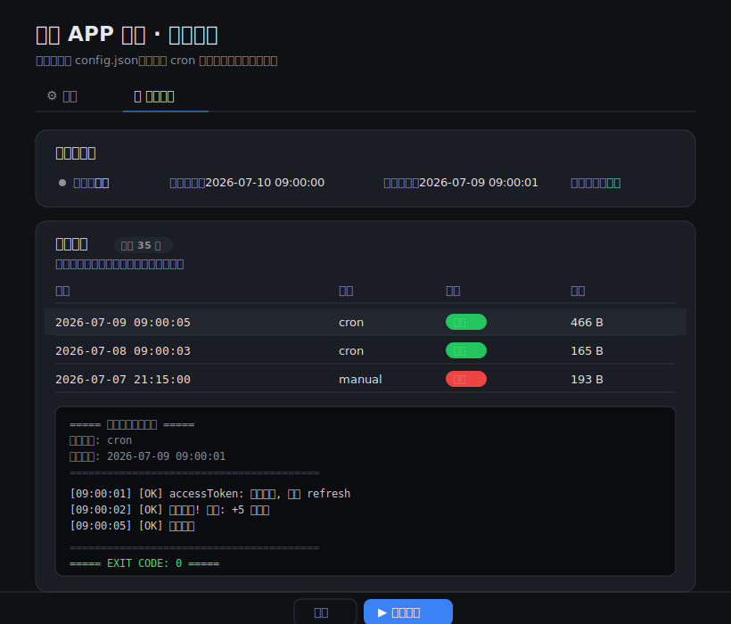

# 领克 APP 自动签到 · Docker 版

支持下原作者：https://github.com/sy5t4w-del/lynk_auto_sign
顺带帮我点点star哦！！

一个自带 **可视化配置页 + cron 定时调度 + 运行日志** 的领克 APP 自动签到服务。
配置全部保存在 `config.json`，容器内后台按 cron 表达式自动运行，日志保留最近 35 天。

## ✨ 功能特性

- 🖥️ **可视化配置页**：浏览器里改配置，无需编辑脚本
- ⏰ **cron 定时调度**：自定义运行时间，改完即时生效，无需重启容器
- ▶️ **手动触发**：配置页「保存并立即执行」/ 日志页「立即运行」
- 📄 **运行日志**：每次运行一条记录，成功/失败一目了然，保留 35 天，可在线查看
- 🔄 **Token 自动续期**：refreshToken 轮换后自动写回 `config.json`，不用手动更新
- 📢 **多渠道推送**：企业微信 / 钉钉 / 飞书 / Telegram / Server酱 / PushPlus / Bark
- 🤝 **自动分享刷积分**：可选，B 账号自动帮主账号刷分享能量体

## 🖼️ 界面预览

| 配置页 | 运行日志页 |
|:---:|:---:|
|  |  |

> 上图为界面示意（数据均为演示用虚构内容）。

## 📁 目录结构

```
lynck/
├── ql_lynk.py            # 签到核心脚本
├── config_server.py      # Web 配置页 + cron 调度 + 日志服务
├── config.html           # 配置页前端
├── config.example.json   # 配置模板（复制成 config.json 使用）
├── requirements.txt      # Python 依赖（仅 requests）
├── Dockerfile
├── docker-compose.yml
├── docs/                 # 界面预览图
└── data/                 # 挂载卷：config.json + logs/（运行后生成，不入库）
```

> `config.json`（含真实 token）已在 `.gitignore` 中忽略，不会被提交。

## 🚀 快速开始（Docker Compose，推荐）

### 1. 准备配置文件

把配置放进挂载目录 `data/`（容器内配置和日志都在这里，持久化不丢）：

```bash
cd lynck
mkdir -p data
cp config.example.json data/config.json     # 复制模板；不复制也行，首次启动会自动生成空模板
```

配置可以先留空，启动后在网页里填写保存即可。

### 2. 启动

```bash
docker compose up -d --build
```

> 镜像只依赖 `requests` 一个第三方库(cron 用内置轻量实现,无需 croniter;时区用内置 zoneinfo,拿不到则退化为固定 +8 偏移),不装系统 tzdata,构建快且不易因软件源不全/缓慢而失败。
> 若默认 pip 源慢,可指定镜像构建:`docker compose build --build-arg PIP_INDEX=https://pypi.tuna.tsinghua.edu.cn/simple`

### 3. 打开配置页

浏览器访问 **`http://<宿主机IP>:8787`**（本机就是 `http://127.0.0.1:8787`）。

- **⚙️ 配置** 标签：填写账号、cron、推送渠道，点「保存配置」即生效
- **📄 运行日志** 标签：看下次运行时间、历史运行记录，点行查看完整日志，可「立即运行」

> 首次没有 token 时会自动生成一份空的 `data/config.json`，在配置页里填好保存即可。

## ⚙️ 配置项说明

所有配置都在 `config.json`（也就是页面上编辑的内容）：

| 字段 | 说明 | 必填 |
|------|------|:---:|
| `refresh_token` | 主账号 refreshToken（28 天有效，`bearer<uuid>` 格式） | ✅ |
| `device_id` | 设备 ID（登录 URL 里的 `deviceId` 参数） | ✅ |
| `cron` | 运行计划，标准 5 段 cron 表达式 | ✅ |
| `auto_share` | 是否启用自动分享刷积分（`true`/`false`） | |
| `token_b` | B 账号 refreshToken 列表（帮主账号点击分享） | |
| `share_content_id` | 分享文章 ID，默认热门文章 | |
| `push.*` | 各推送渠道的 webhook / token（见下） | |

### 如何获取 token

用抓包工具（Charles / Stream 等）抓领克 APP：

- **refreshToken**：抓 `app-services.lynkco.com.cn` 域名下 `mobileCodeLogin` 接口的响应
- **deviceId**：登录请求 URL 里的 `deviceId` 参数

### cron 表达式

标准 5 段格式：`分 时 日 月 周`。配置页提供了常用预设可直接选：

| 表达式 | 含义 |
|--------|------|
| `0 9 * * *` | 每天 09:00 |
| `30 8 * * *` | 每天 08:30 |
| `0 9,21 * * *` | 每天 09:00 和 21:00 |
| `0 */6 * * *` | 每 6 小时 |
| `0 8 * * 1-5` | 工作日 08:00 |

> 触发时区由容器 `TZ` 环境变量决定，默认 `Asia/Shanghai`，可在 `docker-compose.yml` 修改。

### 推送渠道（`push` 字段，全部可选，留空即不推送）

| 字段 | 渠道 |
|------|------|
| `wecom_webhook` | 企业微信机器人 Webhook |
| `dingtalk_webhook` | 钉钉机器人 Webhook |
| `feishu_webhook` | 飞书机器人 Webhook |
| `tg_bot_token` + `tg_chat_id` | Telegram Bot |
| `serverchan_key` | Server酱 SendKey |
| `pushplus_token` | PushPlus Token |
| `bark_url` | Bark 推送 URL |

## 📄 运行日志

- 每次运行生成一个日志文件：`data/logs/run-<时间戳>-<触发方式>.log`
- 触发方式：`cron`（定时）/ `manual`（手动）
- 自动保留最近 **35 天**，超期文件自动清理
- 在「运行日志」页可查看列表和完整内容，运行中的任务也能实时看到输出

## 🛠️ 常用运维命令

```bash
docker compose logs -f          # 看容器/调度器日志
docker compose restart          # 重启
docker compose down             # 停止并删除容器（data/ 里的配置和日志保留）
docker compose up -d --build    # 改了代码后重新构建并启动

# 手动进容器跑一次签到（调试用）
docker compose exec lynk-sign python ql_lynk.py
```

## 🔒 安全提醒

- `config.json` 含明文 token，**不要提交到 Git / 公开分享**（仓库已用 `.gitignore` 忽略）
- 配置页**没有登录鉴权**。如果宿主机在公网，务必做以下之一：
  - 只映射到本机：把 `docker-compose.yml` 的 `"8787:8787"` 改成 `"127.0.0.1:8787:8787"`
  - 前面加一层带鉴权的反向代理（Nginx / Caddy）

## 💻 本地运行（不使用 Docker）

需要 Python 3.8+：

```bash
pip install -r requirements.txt
python config_server.py            # 默认 127.0.0.1:8787，自动打开浏览器
```

常用参数：

```bash
python config_server.py --host 0.0.0.0 --port 9000   # 指定地址/端口
python config_server.py --no-scheduler               # 只开配置页，不跑定时调度
python config_server.py --no-browser                 # 不自动打开浏览器
```

单独跑一次签到（不启服务）：

```bash
python ql_lynk.py
```

## ❓ 常见问题

**Q：改了 cron 需要重启吗？**
不用。调度器每 20 秒读一次 `config.json`，保存后即时生效。

**Q：refreshToken 会过期吗？**
会（28 天）。但每次运行若发生轮换会自动写回 `config.json`，只要签到没断就会一直续上。若长期不运行导致彻底过期，需重新抓包填新 token。

**Q：日志里显示"失败"怎么办？**
点开日志看具体报错。常见原因：token 失效（重新抓包）、网络问题、推送 webhook 配错。

**Q：`data/config.json` 和项目根目录的 `config.json` 是什么关系？**
Docker 用的是 `data/config.json`（通过卷挂载到容器 `/data`）。根目录的 `config.json` 只是本地直接运行时用的，或作为初始模板复制到 `data/`。

## ⚠️ 免责声明

- 本项目仅供**学习与技术交流**，请勿用于商业或违反领克 APP 用户协议的用途，由此产生的一切后果由使用者自行承担。
- 你需要**自行抓包获取自己账号的 token**，本项目不提供、不存储任何账号凭据。
- `ql_lynk.py` 中的 `CA_KEY` / `CA_SECRET` / `APP_CODE` 为 APP 通用接口签名常量（非个人隐私），仅为使脚本能正常调用接口而保留。如你对开源此类常量有顾虑，可自行移除并改由环境变量注入。
- 请及时同步上游 APP 变更；接口失效属正常现象，欢迎提 PR。

## 📄 License

MIT
